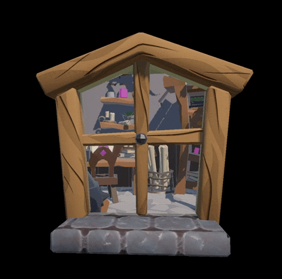

# URP_HoleEffect

The basic demo how to setup hole effect in Unity URP

 
 
 **Demo scene** is on "Assets/URP_StencilBufferWindow/CityViewDemo.unity"
 **Demo scene** is on "Assets/URP_StencilBufferWindow/MaskWindowDemo.unity"

 1. Please check "URP_Setting/URP_Renderer.asset" for how to setup the render features
 2. You need to add "Mask" & "SeeThrough" layer in your project

 # Develop Environment：
 * Unity 2020.2.19f1
 * Unity URP 12