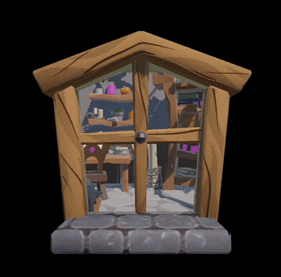

# URP_HoleEffect

The basic demo how to setup hole effect in Unity URP

1. Show basic Stencil Window
 **Demo scene** is on "Assets/URP_StencilBufferWindow/CityViewDemo.unity"

 

2. Show infront element and some innerworld with transparent material
 **Demo scene** is on "Assets/URP_StencilBufferWindow/MaskWindowDemo.unity"

 

3. Object cross the portal
 **Demo scene** is on "Assets/URP_StencilBufferWindow/DinasourDemo.unity"
 

 Inspried by [ar portal arfoundation urp](https://github.com/Tongzhou-Yu/ar-portal-arfoundation-urp) sample

4. User enter the portal to switch display object's layer
 **Demo scene** is on "Assets/URP_StencilBufferWindow/CityViewDemo_enterPortal.unity"

 

# Notic
 1. Please check "URP_Setting/URP_Renderer.asset" & "URP_Setting/Portal_Renderer" for how to setup the render features
 2. You need to add "Mask"(7) & "InnerWorld"(6) layer in your project
 3. You need to add "Portal" tag for detecting trigger enter portal

 # Develop Environment：
 * Unity 2020.2.19f1
 * Unity URP 12